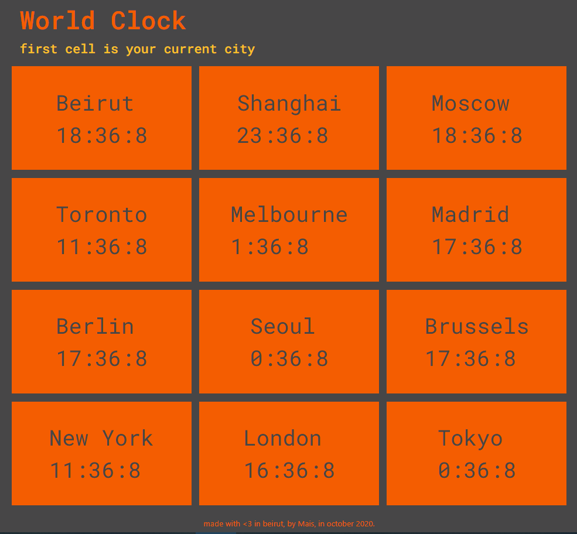

# world-clock
Time 12 cities over the world, including user's own location.
- time according to your IP: https://worldtimeapi.org/api/ip
- docs at https://worldtimeapi.org/

### Screen of the Website

  

